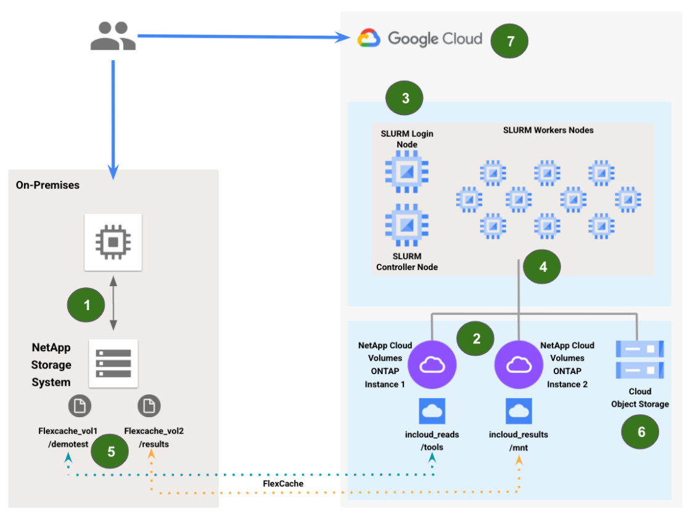

-- Introduction --
The main goal behind this demo is to present a concept and steps required for bursting an EDA workload to the GCP. Following are the key points showcased throughout the the demonstration:
* Access to cloud on-demand compute and storage resources that can help meet tight deadlines
* Effectively leverage the elasticity of the cloud resources to build highly utilized infrastructures
* Accelerate simulations with more cloud compute to shorten time to market
* Benefit from GCP’s collaborations with NetApp throughout the customer’s journey to the cloud

-- Environments and Tools -- 
* EDA Workload burst to GCP Demo recording
* EDA Workload burst to GCP Demo repository 
* Google Cloud Platform
* NetApp Cloud Volumes ONTAP for GCP (https://cloud.google.com/architecture/partners/netapp-cloud-volumes-ontap/netapp-ontap-index)
* NetApp FlexCache Technical Report (https://www.netapp.com/pdf.html?item=/media/7336-tr4743pdf.pdf)
* NetApp FlexCache Volumes Management Guide (https://docs.netapp.com/us-en/ontap/pdfs/sidebar/FlexCache_volumes_management_with_the_CLI.pdf)
* OpenPiton - open source, general-purpose, multithreaded manycore processor and framework (tested with 19-10-23-r13 version) (http://parallel.princeton.edu/openpiton/)
* Icarus Verilog Simulator - an open source Verilog simulation and synthesis tool (tested with 10_2-2.el7 version) (http://iverilog.icarus.com/)
* SLURM workload manager (tested with 19-05-8-1 version) (https://www.schedmd.com/)
* Terraform (version 0.13)- an open-source infrastructure as code software tool that provides a consistent CLI workflow to manage cloud services. (https://www.terraform.io/)

-- Contacts -- 
Alec Shnapir (alecshnapir@google.com)
Guy Rinkevich (guyrinkevich@google.com)

-- Notes and Prerequisites --
* Demo can be reproduced either with on-prem NetApp system or with in-cloud NetApp CVO deployment to simulate the on-prem storage environment
* It's not required to use 2 GCP NetApp CVO instances. Single CVO can perfectly serve for both reads and writes. We’ve decided to deploy 2 CVOs mainly to showcase the ability to separate between reads intensive and write intensive environments. In our case:
 * CVO1 will act as both high-performance storage for EDA workload in GCP and cache for on-prem configuration files
 * CVO2 will be used for “reverse caching”. The results of the jobs run in GCP will be written here and appear to be local from on-prem
* List of GCP infrastructure resources used for this demo:
 * NetApp CVO: 2x CVOs with FlexCache n1-standard-8, 500GB PD-SSD, 1x Cloud Manager (Connector) n1-standard-8
 * SLURM Cluster: 22x n1-standard-2 VMs, 1x 100GB + 20x 20GB PD-SSD, 1x 50GB+1x20GB PD-Standard 
* NetApp CVO how-to preparation GCP project for deployment
* FlexCache license is installed on on-prem NetApp storage system

-- 1. EDA Burst to GCP Demo - High Level Steps Description --
The following summarize the EDA Demo steps:

* Creating Regression Run dataset - creating the EDA working environment in the On-prem (or in-cloud simulation)
* CVO deployment & FlexCache configuration - deploying NetApp CVO  using terraform and configuring the FlexCache relationships
* SLURM Deployment - deploying SLURM Workload Manager using Terraform in GCP 
* Regression Run - Executing the In-cloud EDA regression run 
* Regression Verification - verifying the EDA regression results in the On-prem environment
* Archiving the Results - copying the regression results to GCS (object)
* Cleaning the Project - destroying all the regression run resources from GCP

EDA Burst to Cloud Demo High Level Architecture and Steps

-- 2. EDA Burst to GCP Demo - Detailed Steps Description --
-- 2.1 Demo Walkthrough - Step 1 --
On-prem system, OpenPiton working environment installation:

* Mount one of the on-prem clients to NetApp’s volume that will be extended to the cloud  and install OpenPiton and other prerequisites on this volume (in our case /demotest):
_sudo su
mkdir piton
cd piton
wget https://github.com/PrincetonUniversity/openpiton/archive/openpiton-19-10-23-r13.tar.gz
tar xzvf openpiton-19-10-23-r13.tar.gz
yum groupinstall "Development Tools"_

-- 2.2 Demo Walkthrough - Step 2 --
GCP Project:

Follow these steps from the bastion host to set up the environment and to run the terraform deployment of NetApp CVO instances:

* Download the following NetApp repo and follow the steps from this link: 
https://registry.terraform.io/providers/NetApp/netapp-cloudmanager/latest
* Download the service account json file to the same folder.
* Create Cloud Central account: Signing up to NetApp Cloud Central
* Generate Cloud Central refresh token: https://services.cloud.netapp.com/refresh-token
* Capture the Cloud Central Account ID (next to the account name): https://docs.netapp.com/us-en/occm/task_managing_cloud_central_accounts.html#changing-your-account-name
 
* Update the Terraform resource file (see Appendix A for example): 
_sudo su
vim terraform-provider-netapp-cloudmanager/examples/gcp/resources.tf_
* Export the service account and run the terraform deployment:
_export GOOGLE_APPLICATION_CREDENTIALS="/path/to/service_account.json"
terraform init
terraform plan
terraform apply _
* It will take approximately 5 min to deploy the connector (NetApp Cloud Manager instance) and 15 mins to deploy 2 NetApp CVOs
* Access both NetApp on-prem and GCP NetApp CVOs configurations and collect relevant information that is required for FlexCache relationships configuration. The CVOs can be accessed either through NetApp Cloud Manager (https://docs.netapp.com/us-en/occm/concept_overview.html), NetApp ONTAP CLI (https://docs.netapp.com/us-en/ontap/system-admin/index.html) or NetApp REST API (https://docs.netapp.com/us-en/ontap-automation/how_to_access_the_ontap_api.html). Following information is required for FlexCache and further SLURM configurations:
_cluster name
cluster mgmt addr
cluster intercluster addr
cluster data interface addr server_ip
cluster username
cluster password
cluster aggregate name 
cluster volume name
cluster svm name_

Follow these steps to create the FlexCache relationships between on-prem and in-cloud NetApp storage systems: 

* From GCP bastion host download following scripts from this repository 
fromonprem.py script
fromcloud.py script
* Open fromonprem.py for editing and update required fields with relevant information
* By executing fromonprem.py  script you will create a FlexCache relationship between on-prem NetApp source volume and GCP CVO FlexCache target volume
* Open fromcloud.py for editing and update required fields with relevant information (see Appendix C)
* By executing fromcloud.py  script you will create a FlexCache relationship between and GCP CVO source volume and on-prem NetApp FlexCache target volume

**Note: for optimal performance/results its also suggested to set on-prem NetApp and GCP CVO source volumes atime flag to false (how-to and explanations can be found in: NetApp FlexCache Technical Report page 16 https://www.netapp.com/pdf.html?item=/media/7336-tr4743pdf.pdf)
**

-- 2.3 Demo Walkthrough - Step 3 --
In-cloud GCP Project, SLURM Workload manager configuration

* Open GCP Shell
* Download Terraform scripts for SLURM installation:
_sudo git clone https://github.com/GoogleCloudPlatform/eda-examples_
* Configure Terraform configuration files:
_sudo cd eda-examples/terraform/slurm-cluster
sudo vim basic.tfvars_
* Update the following parameters:
_cluster_name = <will be used for SLURM instances naming>
project = <your project name>
zone = <your zone, make sure you use the same zone for as for CVOs>
network_name = <your VPC>
subnetwork_name = <your subnet name>
disable_controller_public_ips = false (optional)
disable_login_public_ips      = false (optional)_
  * Under network_storage, fill the following information for both CVOs:
_server_ip = “<CVO Data Interface IP>“
remote_mount = “<CVO Volume name>“_
  * Under partitions:
_machine_type = “<SLURM Worker VM configuration>“
13 = “<SLURM Workers Count>“
zone = “<your zone, make sure you use the same zone for as for CVOs>“
vpc_subnet = “<your subnet name>“_
* Save the file and exit

GCP Project, SLURM Workload manager deployment

* From same directory, deploy the SLURM cluster:
_sudo su
terraform init
terraform plan -var-file=basic.tfvars
terraform apply -var-file=basic.tfvars_
* 2 VMs will be created (the third will be deleted a few min after creation):
  * <cluster_name>-login0
  * <cluster_name>-controller
* Login to SLURM login0 node using SSH and wait till setup completes its configuration. It might take ~10-15 min and following message will appear “ *** Slurm login daemon installation complete ***:
_gcloud compute ssh <login0 VM name> --zone <zone>_
* You can verify that the VM is mounted to both CVOs (df -h)
You can verify that you have access to on-prem OpenPiton files by listing the content of your FlexCache volume (in our case ls /incloud_reads)
* For general SLURM cluster info run _sinfo_ command. You should get similar to this output (here is the example for max_node_count = 10, meaning 10 Workers powered off, not allocated and available for use)
 
                PARTITION   AVAIL  TIMELIMIT  NODES  STATE    NODELIST
                debug*           up        infinite          10              idle~      compute-0-[0-9]
 
* Set up the PITON_ROOT environment variable (export PITON_ROOT=<location of root of OpenPiton extracted files on on- prem storage system>). Example:
_sudo export PITON_ROOT=/tools/piton/openpiton-openpiton-19-10-23-r13_
* Set up the simulator home:
_sudo export ICARUS_HOME=/usr/bin/iverilog_
* Source your required settings:
_sudo source $PITON_ROOT/piton/piton_settings.bash_
 
-- 2.4 Demo Walkthrough - Step 4 --
GCP Project, OpenPiton Regression Run with 10 Workers

* From SLURM login0 node start the regression run using the following command (pay attention, the run output directory is located on separated CVO): 
_sudo sims -sim_type=icv -group=tile1_mini -result_dir=/mnt -slurm -sim_q_command=sbatch_
* Once run is started new results directory is created (check the path for results sudo ls -ltr /mnt)
* You can verify run’s progress log (this specific run invokes 46 tests):
_sudo for i in {1..150}; do regreport /mnt/<Results DIR> -summary | egrep -w "PASS|FAIL|UnFinished|Count|Killed"; sleep 10; done_ 
* In addition, you can follow GCP components performance throughout the run using GCP Console Monitoring dashboard:
  * NetApp CVOs - Received and Sent Throughput 
  * SLURM Workers - CPU Utilization, Received and Sent Throughput

-- 2.4 Demo Walkthrough - Step 5 --
GCP Project and on-prem, Regression Run results verification

* Upon job completion (all 46 tests are done and IO is stopped) verify results accessibility both from in-cloud and from on-prem:
  * Present in-cloud created results directory (from <cluster_name>-login0 node ):
_sudo ls -ltr /mnt/<results dir>_
  * Present that these results can be accessed from on-prem client. From on-prem list content of your results directory (in our case /results):
_sudo ls -ltr /results/<results dir>_

-- 2.5 Demo Walkthrough - Step 5.1 (Optional) --
GCP Project, OpenPiton Regression Run with 20 Workers

* Same run with increased number of the SLURM workers presents faster completion time and GCP’s ability for instant scalability
* From SLURM controller node update the number of the SLURM workers
_sudo su
gcloud compute ssh <controller VM name> --zone <zone>
vim /apps/slurm/current/etc/slurm.conf
Scroll to EOF and update the count from [0-9] to [0-19]
systemctl restart slurmctld_
* Follow the same steps as in Step 4 section for to start new Regression Run as with 10 workers
* Follow the same steps as in Step 5 section to access new Regression Run results

-- 2.6 Demo Walkthrough - Step 6 --

From the GCP Project, copy the Regression Run results To Google Cloud Storage (GCS)

* It might happen that the login instance will be deployed without relevant scope. To enable GCS access from login node access following file: 
_vim eda-examples/third_party/slurm-gcp/tf/modules/login/io.tf 
Update the scopes line with “https://www.googleapis.com/auth/cloud-platform”_
* From the SLURM login0 node, create a new bucket. Or skip, if you want to use already existing one:
_gsutil mb gs://<bucket name>_
* From the SLURM login0 node, copy the content of the results directory to the bucket: 
_gsutil -m cp -r /mnt/<results-dir>* gs://<bucket name>_
* Now the results files can be listed using both gcloud CLI and GCP Console Storage browser

-- 2.6 Demo Walkthrough - Step 7 --
GCP Project and on-prem, Environments clean-up

* Open  GCP Shell to destroy SLURM cluster: 
_sudo su
cd eda-examples/terraform/slurm-cluster
terraform delete -var-file burst-cluster.tfvars_
* Login to on-prem NetApp and cloud CVOs and Delete FlexCache relationships
  * Delete FlexCache Volumes:
    * From the cluster that has the FlexCache volume, take the FlexCache volume offline: 
_sudo su
ssh <username>@<cluster mgmt ip>
volume offline <volume name>_
    * Delete the FlexCache volume:
_volume flexcache delete -volume <name> -vserver <vserver name>_
  * From the origin cluster, clean up the FlexCache relationship:
    * Delete vserver peer connections:
_sudo su
ssh <username>@<cluster mgmt ip>
vserver peer delete -vserver <vserver name> -peer-vserver <peer vserver name>_
    * Delete cluster peer connections:
_cluster peer delete -cluster <cluster name>_
* Connect to bastion host to Delete CVO deployments:  
_sudo su
terraform destroy_

